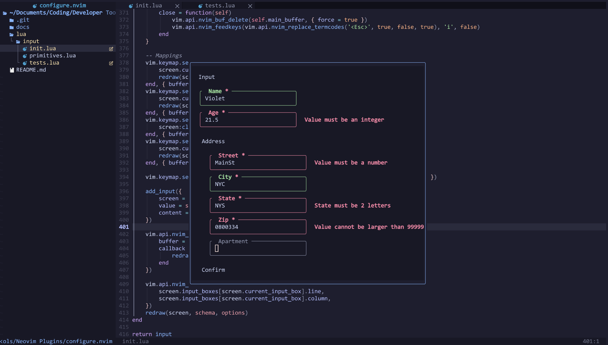

# `input.nvim`

**Warning: `input.nvim` is not complete yet. It may/will not work.**

`input.nvim` is a Neovim library that creates window prompts for users and validates data.

## 🚀 Example

This input code:

```lua
local input = require("input")
local primitives = require("input.primitives")

local string = primitives.string
local integer = primitives.integer

input(
    {
        name = string(),
        age = integer():positive():max(100),
        address = {
            street = integer():positive(),
            city = string(),
            state = string():one_of({ "NY", "PA" }),
            zip = string():length(5):match("^%d+$"),
            apartment = string():optional()
        }
    },
    {
        on_complete = function(person_info)
            print(vim.inspect(person_info))
        end
    }
)
```

Creates this window:



## ⚡ Features

- ✅ Automatically validate inputs with a variety of provided utility functions
- ⚙️ Validate inputs with custom functions
- 📶 Shows all input prompts in the order they're declared
- 🔤 Automatically converts input names into title case
- 🕦 Runs asynchronously, executing a callback upon completion

For a full list of provided functions, see [primitives.lua](https://github.com/vi013t/input.nvim/tree/main/lua/input/primitives.lua).
